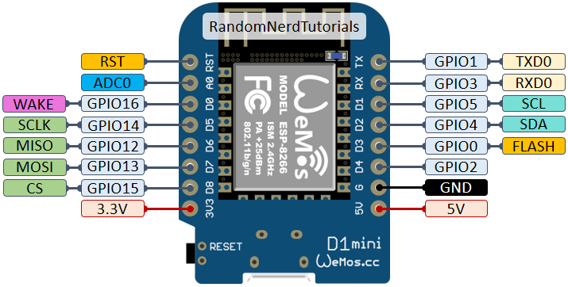

# ADAU1701-TCPi-ESP32

WiFi bridge between **SigmaStudio** and the **ADAU1701 DSP** using a ~$3 ESP32.  
Replaces ICP1 / ICP3 / ICP5 USB dongles. No pops or clicks thanks to hardware safeload.


<!-- Photo: ESP32 connected to JAB4/ADAU1701 board. Save as docs/hardware.jpg -->


---

## Flash the firmware

### Option A — Web browser (Chrome or Edge, no software needed)
👉 **[Open web installer](https://rarranzb.github.io/ADAU1701-TCPi-ESP32)**

### Option B — One command (Linux / macOS)
```bash
curl -fsSL https://raw.githubusercontent.com/rarranzb/ADAU1701-TCPi-ESP32/main/install.sh | bash
```

### Option C — Manual with esptool
```bash
pip install esptool
esptool.py --chip esp32 --baud 460800 write_flash 0x0 firmware/ADAU1701_TCPi_ESP32.bin
```

---

## First-time setup

1. The ESP32 creates a WiFi hotspot: **`ADAU1701-ESP32`** · password: `adau1701`
2. Connect to it and open **`http://192.168.4.1`**
3. Go to **Configuration** → enter your WiFi SSID and password → **Save**
4. The ESP32 connects to your network and shows the assigned IP address
5. Your browser redirects automatically — bookmark that IP
6. In SigmaStudio: `USBi → TCP/IP → <ESP32 IP> : 8086`

All settings (WiFi credentials, GPIO pins) are configured from the web interface — no code changes needed.

---

## Wiring

```
ADAU1701 / JAB4 (J4)      ESP32
────────────────────      ──────────
SCL  ─────────────────→   GPIO 17
SDA  ─────────────────→   GPIO 16
RESET ────────────────→   GPIO 21
SELFBOOT ─────────────→   GPIO 19
3.3V ─────────────────→   3.3V
GND  ─────────────────→   GND
```

```
ADAU1701 / JAB4 (J4)      ESP8266
────────────────────      ──────────
SCL  ─────────────────→   GPIO 5 (D1)
SDA  ─────────────────→   GPIO 4 (D2)
RESET ────────────────→   GPIO 0 (D3)
SELFBOOT ─────────────→   GPIO 12 (D6)
WRITE PROTECT ────────→   GPIO 13 (D7) ───→ 10 kOm ──→ 3.3V
3.3V ─────────────────→   3.3V
GND  ─────────────────→   GND
```

Pins are reconfigurable from `http://ESP32-IP/config`.

---

## Features

- ✅ Full SigmaStudio TCPi protocol over WiFi (TCP port 8086)
- ✅ **Hardware safeload** — no pops or clicks when changing parameters in real time
- ✅ **Save to EEPROM** from the web interface (selfboot). Add support WP pin.
- ✅ Web interface for WiFi and GPIO configuration
- ✅ Shows assigned IP address before rebooting after WiFi setup
- ✅ AP mode for first-time setup from any phone or PC
- ✅ BOOT button triggers DSP hardware reset

---

## Web interface

| URL | Description |
|-----|-------------|
| `http://IP/` | Status, Save to EEPROM button, DSP reset |
| `http://IP/config` | WiFi credentials and GPIO pins |
| `http://IP/status` | JSON status |
| `http://IP/factory_reset` | Clear all settings |

### Save to EEPROM (selfboot)

1. Do a **Link Compile Download** in SigmaStudio as usual
2. Open `http://ESP32-IP/` → click **Save to EEPROM**
3. Wait ~5 seconds
4. Enable the SELFBOOT pin/jumper on your DSP board
5. Power cycle → the ADAU1701 boots autonomously from EEPROM

---

## ICP vs ESP32

| | ICP1/ICP3/ICP5 | This project |
|-|---------------|-------------|
| Connection | USB | WiFi |
| Cost | $30–40 | ~$3 |
| No pops on parameter change | ✗ | ✅ |
| Save to EEPROM | ✅ | ✅ |
| Web configuration | ✗ | ✅ |
| Open source | ✗ | ✅ |

---

## Build from source

1. Open `ADAU1701_TCPi_ESP32.ino` in Arduino IDE
2. `Tools → Board → ESP32 Dev Module`
3. `Sketch → Export Compiled Binary`
4. Merge into a single file:

```bash
mkdir firmware
esptool.py --chip esp32 merge_bin \
  --output firmware/ADAU1701_TCPi_ESP32.bin \
  0x1000  build/*/ADAU1701_TCPi_ESP32.ino.bootloader.bin \
  0x8000  build/*/ADAU1701_TCPi_ESP32.ino.partitions.bin \
  0x10000 build/*/ADAU1701_TCPi_ESP32.ino.bin
```

5. Commit and push `firmware/ADAU1701_TCPi_ESP32.bin`

---

## How it works

The TCPi protocol used by SigmaStudio includes a `safeload` flag per write packet.
When `safeload=1` (real-time parameter update), this firmware uses the ADAU1701
hardware safeload registers (0x0810–0x081C) to transfer coefficients atomically
at the start of the next audio frame. The DSP never processes half-updated filters.

Large writes are split into 5-word chunks — one IST trigger per chunk.
No muting needed.

---

## License

MIT — see [LICENSE](LICENSE)
